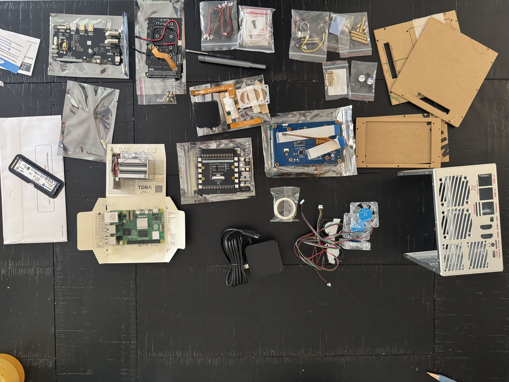
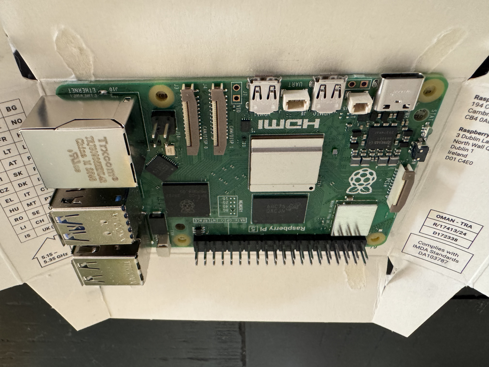
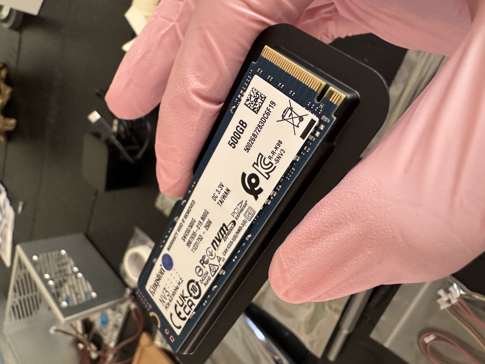

# Raspberry Pi 5 Cybersecurity Home Lab
# June 13, 2026
# Bryant Palmero

# Project Overview: 🥅

This project documents the complete build and setup of my Respberry Pi 5 cybersecurity home lab. I built this raspberry pi as a protected environment where I can develop practical skills for penetration testing, network analysis, system administration and security monotoring projects.

This repository documents my whole process form hardware selection and physical assembly to installing Rasberry Pi OS, configuring NVMe storage, troubleshooting problems, and getting the system fully operational. Rather than only showing th finished product, I will also document the challenges I encountered, how I solved them, and what I learned throughout the process. 

# 1. Hardware & Initial thoughts

I began this project by gathering all the necessary hardware to build my Raspberry Pi lab. Originally, I planned on using a simple Raspberry Pi motherboard and creating projects from there. However, I wanted to build something more creative and unique rather than it being simple. After seeing an enclosed Raspberry Pi build for sale on Facebook Marketplace, I was inspired to create my own enclosed small Pi that I could customize and eventually use as a dedicated cybersecurity home lab and target server.  

# 2. Physical Build

Before beginning the actual assembly, I did a quick revision of the motherbaord to make sure nothing was damaged. Here is where the actual build began. 

# 3. NMVe Storage

For storage, I chose a 500GB Kingston NVMe SSD. My original Raspberry Pi OS installation would be done using a microSD card, but I planned to eventually migrate the operating system onto the NVMe SSD. This would allow the SSD to become the main boot drive for the Raspberry Pi and provide more storage for future cybersecurity tools, applications, logs, and lab environments. Once out of storage I will be able to add multiple SSDs since I am only using 1 slot as of now. 

# 4. Case and Cooling System

| Component | Purpose |
|---|---|
| Raspberry Pi 5 (8GB) | Primary server and target system for the cybersecurity home lab |
| Freenove NAS Case | Enclosure providing cooling, touchscreen integration, and NVMe expansion |
| Kingston NV3 500GB NVMe SSD | Primary storage and boot drive for Raspberry Pi OS, applications, logs, and future lab environments |
| Alfa Network AWUS036AXML Wi-Fi Adapter | External wireless adapter for future wireless networking and security labs |
| Raspberry Pi 27W USB-C Power Supply | Provides stable power to the Raspberry Pi 5 and connected hardware |
| 32GB SanDisk microSD Card | Used for the initial Raspberry Pi OS installation before migrating the system to NVMe storage |

- [x] Raspberry Pi 5 assembled
- [x] Raspberry Pi OS installed
- [x] System migrated from microSD to NVMe
- [x] NVMe boot verified
- [x] Network connectivity configured
- [ ] SSH configuration
- [ ] Docker installation
- [ ] Cybersecurity lab services
